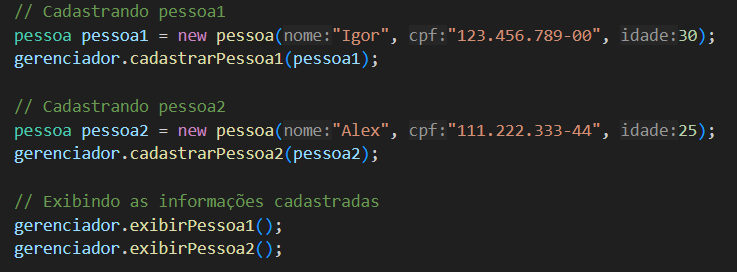

sistema de gerenciamento de pessoas que permita o cadastro de indivíduos, a consulta de informações e a atualização de dados pessoais

Exemplo de uso.

lógica de encapsulamento
os atributos da classe pessoa são privados e seus métodos publicos